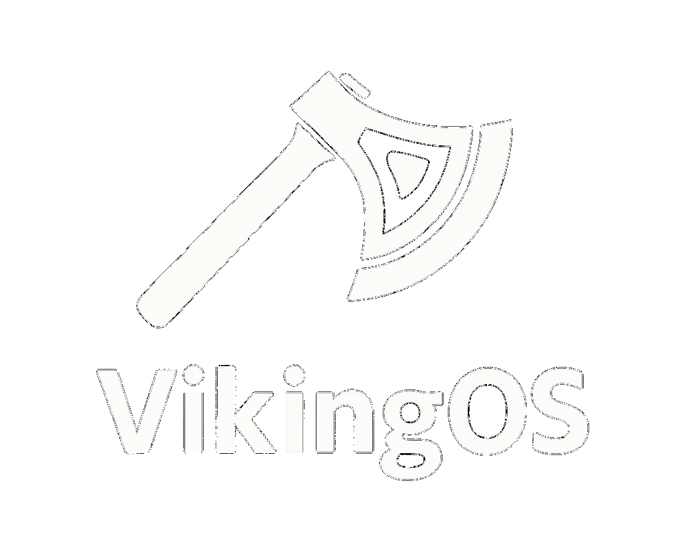

<p align="center">

</p>
  
> **⚠ Warning**<br> VikingOS is still under development and lacks a lot of features. I do not recommend you to use it just yet.


## Getting Started:

**1.** Build the OS:
```
$ git clone https://github.com/DrSoftman/VikingOS
$ cd VikingOS
$ make img
```


**2.** Run the OS with QEMU:
```
$  qemu-system-i386 --drive format=raw,file=vikingos.img -monitor stdio -no-reboot -d guest_errors,int,pcall,unimp,out_asm -D debug.log
```
Remove the ``-monitor stdio`` and use ``-nographic`` to run it just in the terminal.

**Building on real hardware...**
Do not build VikingOS on real hardware, just don't. But if you are really that willing to destroy your computer, sure go ahead!
```
$ make iso
```
Burn the vikingos.iso onto a bootable USB, I would probably be lying if I said that this would work. 

## Support:
Please email me on kaenklalle@gmail.com!
I will try to respond as soon as possible if I have time! God bless!
